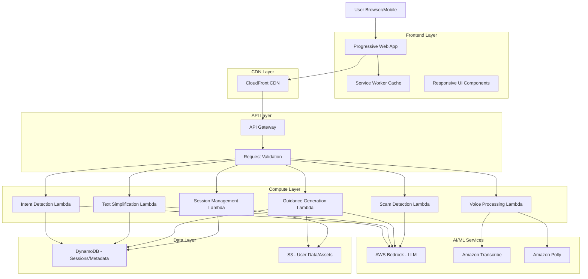

# Design Document: Adhikar Setu AI

## Overview

Adhikar Setu AI is a serverless, mobile-first web application that democratizes legal awareness for Indian citizens, particularly those in underserved communities. The system leverages AWS managed services to provide multilingual, voice-enabled legal assistance while optimizing for low-bandwidth environments.

### Core Design Principles

1. **Mobile-First**: All interfaces designed for small screens and touch interaction
2. **Voice-First**: Prioritize voice interaction over text for accessibility
3. **Bandwidth-Conscious**: Minimize data transfer and support offline capabilities
4. **Language-Inclusive**: Support major Indian languages with cultural context
5. **Simplicity**: Reduce cognitive load through clear, simple explanations
6. **Serverless**: Leverage AWS managed services for scalability and cost-efficiency

### Key Technologies

- **AWS Bedrock**: LLM processing for intent detection, text simplification, and guidance generation
- **Amazon Transcribe**: Real-time speech-to-text with Indian language support
- **Amazon Polly**: Neural text-to-speech with Indian language voices
- **AWS Lambda**: Serverless compute for all backend logic
- **Amazon S3**: Storage for user sessions, cached content, and static assets
- **Amazon CloudFront**: CDN for low-latency content delivery
- **Amazon API Gateway**: RESTful API management and request routing
- **Amazon DynamoDB**: Fast, scalable NoSQL database for session and metadata storage

## Architecture

### System Architecture



### Request Flow Patterns

#### Voice Query Flow
1. User speaks query in mobile browser
2. Audio captured and sent to Voice Processing Lambda via API Gateway
3. Lambda invokes Amazon Transcribe for speech-to-text
4. Transcribed text sent to Intent Detection Lambda
5. Intent Detection Lambda uses Bedrock to classify query
6. Response routed to appropriate handler (Guidance, Explanation, etc.)
7. Response text sent to Amazon Polly for text-to-speech
8. Audio response streamed back to user

#### Text Query Flow
1. User types query in selected language
2. Query sent to Intent Detection Lambda via API Gateway
3. Intent classified using Bedrock
4. Response generated and simplified using Text Simplification Lambda
5. Text response returned to user
6. Session data saved to DynamoDB

### Deployment Architecture

- **Frontend**: Static assets hosted on S3, distributed via CloudFront
- **Backend**: Lambda functions in Mumbai (ap-south-1) region for low latency
- **Database**: DynamoDB with on-demand capacity for cost optimization
- **Storage**: S3 with lifecycle policies (90-day retention, then deletion)

## Components and Interfaces

### Frontend Components

#### 1. Progressive Web App (PWA) Shell

**Responsibilities:**
- Provide offline-capable application shell
- Manage service worker for caching
- Handle responsive layout rendering
- Coordinate voice and text input modes

**Key Features:**
- Installable on mobile home screen
- Offline fallback for cached content
- Background sync for queued requests
- Push notification support for guidance reminders

#### 2. Voice Interface Component

**Responsibilities:**
- Capture audio input from device microphone
- Stream audio to backend for transcription
- Play audio responses from text-to-speech
- Provide visual feedback during voice interaction

**Interface:**
```typescript
interface VoiceInterface {
  startRecording(): Promise<void>
  stopRecording(): Promise<AudioBlob>
  playAudio(audioUrl: string): Promise<void>
  getRecordingStatus(): RecordingStatus
}

type RecordingStatus = 'idle' | 'recording' | 'processing' | 'playing'
```

#### 3. Language Selector Component

**Responsibilities:**
- Display available languages
- Persist language preference
- Trigger UI re-rendering on language change

**Supported Languages:**
- Hindi (hi-IN)
- English (en-IN)
- Tamil (ta-IN)
- Telugu (te-IN)
- Bengali (bn-IN)
- Marathi (mr-IN)
- Gujarati (gu-IN)
- Kannada (kn-IN)
- Malayalam (ml-IN)
- Punjabi (pa-IN)

#### 4. Query Input Component

**Responsibilities:**
- Accept text or voice input
- Display input history
- Show typing indicators and processing status
- Handle input validation

**Interface:**
```typescript
interface QueryInput {
  submitTextQuery(text: string, language: string): Promise<QueryResponse>
  submitVoiceQuery(audio: AudioBlob, language: string): Promise<QueryResponse>
  clearInput(): void
}
```

#### 5. Response Display Component

**Responsibilities:**
- Render simplified legal explanations
- Display step-by-step guidance
- Show document checklists with checkboxes
- Present scam alerts prominently
- Support both text and voice output

**Interface:**
```typescript
interface ResponseDisplay {
  renderExplanation(content: SimplifiedContent): void
  renderGuidance(steps: GuidanceStep[]): void
  renderChecklist(documents: DocumentItem[]): void
  renderScamAlert(alert: ScamAlert): void
  enableLowLiteracyMode(enabled: boolean): void
}
```

### Backend Components

#### 1. Intent Detection Service

**Responsibilities:**
- Analyze user queries using AWS Bedrock
- Classify queries into legal categories
- Extract key entities (dates, amounts, parties)
- Determine confidence scores
- Request clarification when needed

**Lambda Function:** `intent-detection-handler`

**Interface:**
```typescript
interface IntentDetectionService {
  detectIntent(query: string, language: string): Promise<IntentResult>
  extractEntities(query: string): Promise<Entity[]>
}

interface IntentResult {
  categories: LegalCategory[]
  confidence: number
  entities: Entity[]
  needsClarification: boolean
  clarificationQuestions?: string[]
}

type LegalCategory = 
  | 'consumer_rights'
  | 'labor_rights'
  | 'property_disputes'
  | 'family_law'
  | 'criminal_law'
  | 'civil_rights'
  | 'government_schemes'

interface Entity {
  type: 'date' | 'amount' | 'person' | 'organization' | 'location'
  value: string
  confidence: number
}
```

**Bedrock Integration:**
- Model: Claude 3 Haiku (fast, cost-effective)
- Prompt engineering for Indian legal context
- Few-shot examples for each legal category
- Structured output format for consistent parsing

#### 2. Text Simplification Service

**Responsibilities:**
- Simplify legal language using AWS Bedrock
- Adjust reading level based on mode (standard vs low-literacy)
- Translate content to user's selected language
- Preserve legal accuracy while improving clarity

**Lambda Function:** `text-simplification-handler`

**Interface:**
```typescript
interface TextSimplificationService {
  simplify(
    legalText: string,
    targetLanguage: string,
    readingLevel: ReadingLevel
  ): Promise<SimplifiedContent>
}

type ReadingLevel = 'standard' | 'low_literacy'

interface SimplifiedContent {
  simplifiedText: string
  readingLevel: number // Grade level
  keyTerms: Term[]
  examples: string[]
}

interface Term {
  original: string
  simplified: string
  definition: string
}
```

**Simplification Strategy:**
- Standard mode: Grade 6-8 reading level
- Low-literacy mode: Grade 3-5 reading level
- Replace legal jargon with everyday terms
- Break complex sentences into shorter ones
- Add contextual examples from Indian scenarios

#### 3. Guidance Generation Service

**Responsibilities:**
- Generate personalized step-by-step complaint guidance
- Include relevant authorities and contact information
- Provide timelines and deadlines
- Create document checklists
- Save guidance for user retrieval

**Lambda Function:** `guidance-generation-handler`

**Interface:**
```typescript
interface GuidanceGenerationService {
  generateGuidance(
    category: LegalCategory,
    userContext: UserContext,
    language: string
  ): Promise<GuidanceResult>
  
  saveGuidance(sessionId: string, guidance: GuidanceResult): Promise<string>
  retrieveGuidance(guidanceId: string): Promise<GuidanceResult>
}

interface UserContext {
  situation: string
  location: string // State/city for jurisdiction-specific guidance
  entities: Entity[]
  urgency: 'immediate' | 'normal' | 'non_urgent'
}

interface GuidanceResult {
  guidanceId: string
  steps: GuidanceStep[]
  documentChecklist: DocumentItem[]
  estimatedTimeline: string
  authorities: Authority[]
  additionalResources: Resource[]
}

interface GuidanceStep {
  stepNumber: number
  title: string
  description: string
  actionType: 'online' | 'in_person' | 'phone' | 'document'
  estimatedDuration: string
  deadline?: string
  tips: string[]
}

interface DocumentItem {
  name: string
  description: string
  required: boolean
  format: 'original' | 'photocopy' | 'notarized' | 'self_attested'
  acquisitionGuidance?: string
}

interface Authority {
  name: string
  contactNumber?: string
  website?: string
  address?: string
  workingHours?: string
}

interface Resource {
  title: string
  url: string
  description: string
}
```

**Guidance Generation Strategy:**
- Use Bedrock with jurisdiction-specific prompts
- Include state/city-specific authority information
- Reference relevant Indian laws and acts
- Provide both online and offline options
- Consider user's urgency level

#### 4. Voice Processing Service

**Responsibilities:**
- Convert speech to text using Amazon Transcribe
- Convert text to speech using Amazon Polly
- Handle audio format conversions
- Optimize audio quality vs file size for bandwidth

**Lambda Function:** `voice-processing-handler`

**Interface:**
```typescript
interface VoiceProcessingService {
  transcribeAudio(
    audioBlob: Buffer,
    language: string
  ): Promise<TranscriptionResult>
  
  synthesizeSpeech(
    text: string,
    language: string,
    voiceGender: 'male' | 'female'
  ): Promise<AudioResult>
}

interface TranscriptionResult {
  text: string
  confidence: number
  language: string
  alternatives?: string[]
}

interface AudioResult {
  audioUrl: string
  duration: number
  format: 'mp3' | 'ogg'
  sizeBytes: number
}
```

**Amazon Transcribe Configuration:**
- Real-time streaming for immediate feedback
- Custom vocabulary for legal terms in Indian languages
- Automatic language detection as fallback
- Confidence thresholds for quality control

**Amazon Polly Configuration:**
- Neural voices for natural-sounding speech
- Language-specific voices (Aditi for Hindi, Raveena for English-IN, etc.)
- Speech rate adjustment for clarity
- SSML for emphasis on important terms
- Audio compression for bandwidth optimization

#### 5. Scam Detection Service

**Responsibilities:**
- Analyze user situations for scam indicators
- Identify red flags and suspicious patterns
- Generate contextual warnings
- Provide verification guidance

**Lambda Function:** `scam-detection-handler`

**Interface:**
```typescript
interface ScamDetectionService {
  analyzeForScams(
    userQuery: string,
    context: UserContext
  ): Promise<ScamAnalysisResult>
}

interface ScamAnalysisResult {
  isScamLikely: boolean
  confidence: number
  redFlags: RedFlag[]
  verificationSteps: string[]
  reportingGuidance: string
}

interface RedFlag {
  indicator: string
  description: string
  severity: 'low' | 'medium' | 'high'
}
```

**Scam Detection Patterns:**
- Upfront payment requests for legal services
- Unofficial communication channels (personal email/phone)
- Pressure tactics and artificial urgency
- Guaranteed outcomes or unrealistic promises
- Requests for sensitive information (Aadhaar, bank details)
- Impersonation of government officials
- Spelling errors in official-looking documents

#### 6. Session Management Service

**Responsibilities:**
- Create and manage user sessions
- Store and retrieve user data
- Handle data encryption
- Implement data retention policies
- Provide session cleanup

**Lambda Function:** `session-management-handler`

**Interface:**
```typescript
interface SessionManagementService {
  createSession(): Promise<SessionInfo>
  getSession(sessionId: string): Promise<SessionData>
  updateSession(sessionId: string, data: Partial<SessionData>): Promise<void>
  deleteSession(sessionId: string): Promise<void>
  cleanupExpiredSessions(): Promise<number>
}

interface SessionInfo {
  sessionId: string
  createdAt: string
  expiresAt: string
}

interface SessionData {
  sessionId: string
  language: string
  lowLiteracyMode: boolean
  queryHistory: QueryRecord[]
  savedGuidance: string[]
  preferences: UserPreferences
  lastAccessedAt: string
}

interface QueryRecord {
  timestamp: string
  query: string
  intent: IntentResult
  response: string
}

interface UserPreferences {
  voiceGender: 'male' | 'female'
  textSize: 'small' | 'medium' | 'large'
  autoPlayAudio: boolean
}
```

**Data Storage Strategy:**
- DynamoDB for session metadata and query history
- S3 for generated guidance documents
- Client-side sessionStorage for temporary data
- 90-day retention policy with automatic cleanup
- Encryption at rest using AWS KMS

### API Endpoints

**Base URL:** `https://api.adhikarsetu.in/v1`

#### POST /query/text
Submit a text query for processing.

**Request:**
```json
{
  "sessionId": "string",
  "query": "string",
  "language": "string",
  "lowLiteracyMode": boolean
}
```

**Response:**
```json
{
  "intent": {
    "categories": ["string"],
    "confidence": number
  },
  "response": {
    "text": "string",
    "audioUrl": "string (optional)",
    "type": "explanation | guidance | clarification"
  },
  "scamAlert": {
    "isScamLikely": boolean,
    "redFlags": ["string"]
  } (optional)
}
```

#### POST /query/voice
Submit a voice query for processing.

**Request:**
```
Content-Type: multipart/form-data
- sessionId: string
- audio: file (audio/webm, audio/mp3, audio/wav)
- language: string
- lowLiteracyMode: boolean
```

**Response:** Same as /query/text

#### POST /guidance/generate
Generate personalized complaint guidance.

**Request:**
```json
{
  "sessionId": "string",
  "category": "string",
  "userContext": {
    "situation": "string",
    "location": "string",
    "urgency": "string"
  },
  "language": "string"
}
```

**Response:**
```json
{
  "guidanceId": "string",
  "steps": [
    {
      "stepNumber": number,
      "title": "string",
      "description": "string",
      "actionType": "string",
      "estimatedDuration": "string"
    }
  ],
  "documentChecklist": [
    {
      "name": "string",
      "description": "string",
      "required": boolean,
      "format": "string"
    }
  ],
  "authorities": [
    {
      "name": "string",
      "contactNumber": "string",
      "website": "string"
    }
  ]
}
```

#### GET /guidance/{guidanceId}
Retrieve previously generated guidance.

**Response:** Same as /guidance/generate response

#### POST /session/create
Create a new user session.

**Response:**
```json
{
  "sessionId": "string",
  "expiresAt": "string (ISO 8601)"
}
```

#### DELETE /session/{sessionId}
Delete user session and associated data.

**Response:**
```json
{
  "success": boolean,
  "message": "string"
}
```

## Data Models

### DynamoDB Tables

#### Sessions Table

**Table Name:** `adhikar-setu-sessions`

**Primary Key:**
- Partition Key: `sessionId` (String)

**Attributes:**
```typescript
{
  sessionId: string
  createdAt: string // ISO 8601
  lastAccessedAt: string // ISO 8601
  expiresAt: number // Unix timestamp for TTL
  language: string
  lowLiteracyMode: boolean
  preferences: {
    voiceGender: string
    textSize: string
    autoPlayAudio: boolean
  }
}
```

**Indexes:**
- GSI: `expiresAt-index` for cleanup operations

**TTL:** Enabled on `expiresAt` attribute (90 days)

#### Query History Table

**Table Name:** `adhikar-setu-query-history`

**Primary Key:**
- Partition Key: `sessionId` (String)
- Sort Key: `timestamp` (String)

**Attributes:**
```typescript
{
  sessionId: string
  timestamp: string // ISO 8601
  query: string
  queryType: 'text' | 'voice'
  intent: {
    categories: string[]
    confidence: number
  }
  responseType: 'explanation' | 'guidance' | 'clarification'
  scamAlertTriggered: boolean
}
```

#### Guidance Metadata Table

**Table Name:** `adhikar-setu-guidance-metadata`

**Primary Key:**
- Partition Key: `guidanceId` (String)

**Attributes:**
```typescript
{
  guidanceId: string
  sessionId: string
  createdAt: string // ISO 8601
  category: string
  language: string
  location: string
  s3Key: string // Reference to full guidance in S3
  expiresAt: number // Unix timestamp for TTL
}
```

**Indexes:**
- GSI: `sessionId-createdAt-index` for retrieving user's guidance history

**TTL:** Enabled on `expiresAt` attribute (90 days)

### S3 Bucket Structure

**Bucket Name:** `adhikar-setu-user-data`

**Structure:**
```
/guidance/
  /{guidanceId}.json          # Full guidance documents
/audio-cache/
  /{language}/
    /{textHash}.mp3           # Cached TTS audio for common phrases
/static-content/
  /legal-templates/
    /{category}/
      /{language}.json        # Pre-translated legal templates
```

**Lifecycle Policies:**
- `/guidance/`: Delete after 90 days
- `/audio-cache/`: Delete after 30 days
- `/static-content/`: No expiration

### Client-Side Data Models

#### Session Storage

```typescript
interface ClientSession {
  sessionId: string
  language: string
  lowLiteracyMode: boolean
  currentQuery: string
  pendingAudio: AudioBlob | null
}
```

#### Service Worker Cache

**Cache Name:** `adhikar-setu-v1`

**Cached Resources:**
- Application shell (HTML, CSS, JS)
- Language-specific UI strings
- Common legal term definitions
- Offline fallback page

**Cache Strategy:**
- Network-first for API calls
- Cache-first for static assets
- Stale-while-revalidate for translations


## Correctness Properties

*A property is a characteristic or behavior that should hold true across all valid executions of a system—essentially, a formal statement about what the system should do. Properties serve as the bridge between human-readable specifications and machine-verifiable correctness guarantees.*

### Property Reflection

After analyzing all acceptance criteria, I've identified the following redundancies and consolidations:

**Consolidated Properties:**
- Language consistency properties (1.1, 1.3, 3.4) can be combined into a single property about language consistency across all system outputs
- Guidance structure properties (4.3, 4.4, 4.5, 4.6) can be combined into a comprehensive property about guidance completeness
- Document checklist properties (5.3, 5.4, 5.5) can be combined into a property about checklist item completeness
- Scam alert properties (6.4, 6.5, 6.6) can be combined into a property about alert completeness
- Accessibility properties (12.1, 12.3, 12.5) can be combined into a property about accessibility compliance

**Eliminated Redundancies:**
- Property about LLM service invocation (2.1, 4.2) is redundant with intent detection and guidance generation properties
- Multiple properties about data structure validation can be consolidated

### Core Properties

#### Property 1: Language Consistency Across System

*For any* user session with a selected language, all system outputs (UI text, responses, audio) should be in that selected language.

**Validates: Requirements 1.1, 1.3, 3.4**

**Rationale:** This ensures the multilingual experience is consistent across all interaction points. Users should never see mixed languages in a single session.

#### Property 2: Intent Detection Produces Valid Categories

*For any* user query, the intent detection result should contain only categories from the defined set of legal categories (consumer_rights, labor_rights, property_disputes, family_law, criminal_law, civil_rights, government_schemes).

**Validates: Requirements 2.2, 2.3**

**Rationale:** This ensures the system only produces recognized legal categories that have associated handling logic.

#### Property 3: Low Confidence Triggers Clarification

*For any* intent detection result with confidence below 70%, the system should request clarification from the user.

**Validates: Requirements 2.5**

**Rationale:** This prevents the system from acting on uncertain interpretations and improves accuracy through user feedback.

#### Property 4: Low-Literacy Mode Simplifies Output

*For any* text response, when low-literacy mode is enabled, the output should be different from (and simpler than) standard mode output for the same query.

**Validates: Requirements 3.3**

**Rationale:** This ensures low-literacy mode actually modifies the output rather than being a no-op.

#### Property 5: Explanations Are Structured

*For any* legal explanation, the output should contain numbered steps or bullet points (structured formatting).

**Validates: Requirements 3.6**

**Rationale:** Structured content is easier to understand and follow than unformatted paragraphs.

#### Property 6: Guidance Contains Complete Structure

*For any* generated guidance, it should contain: (1) a non-empty list of numbered steps, (2) authority information, (3) action types for each step, and (4) estimated timelines.

**Validates: Requirements 4.3, 4.4, 4.5, 4.6**

**Rationale:** Complete guidance must include all essential components to be actionable. This single property validates the entire guidance structure.

#### Property 7: Guidance Persistence Round-Trip

*For any* generated guidance, saving it and then retrieving it by its guidance ID should produce an equivalent guidance object.

**Validates: Requirements 4.7, 9.1**

**Rationale:** This is a round-trip property ensuring data persistence works correctly without data loss or corruption.

#### Property 8: Checklist Generated With Guidance

*For any* guidance generation request, the result should include a non-empty document checklist.

**Validates: Requirements 5.1**

**Rationale:** Every legal procedure requires documents, so checklists should always be generated with guidance.

#### Property 9: Checklist Items Are Complete

*For any* document checklist item, it should have: (1) a name, (2) a description, (3) a required flag, and (4) a format specification.

**Validates: Requirements 5.3, 5.4, 5.5**

**Rationale:** Complete checklist items provide all information users need to gather documents.

#### Property 10: Document Tracking State Management

*For any* document checklist, marking a document as collected and then retrieving the checklist should show that document as collected.

**Validates: Requirements 5.7**

**Rationale:** This tests state management for document tracking functionality.

#### Property 11: Scam Detection Always Runs

*For any* user query, the scam detection analysis should be performed automatically without requiring explicit activation.

**Validates: Requirements 6.1, 6.7**

**Rationale:** Automatic scam detection protects vulnerable users who may not know to look for scams.

#### Property 12: High-Confidence Scams Trigger Alerts

*For any* scam analysis result with confidence above 60%, the system should display a warning to the user.

**Validates: Requirements 6.2**

**Rationale:** This ensures users are warned about likely scams based on the confidence threshold.

#### Property 13: Scam Alerts Are Complete

*For any* triggered scam alert, it should include: (1) specific red flags detected, (2) verification steps, and (3) reporting guidance.

**Validates: Requirements 6.4, 6.5, 6.6**

**Rationale:** Complete alerts provide users with actionable information to protect themselves.

#### Property 14: Scam Detection Identifies Known Patterns

*For any* query containing known scam indicators (upfront payment requests, unofficial channels, pressure tactics, guaranteed outcomes), the scam detection should identify at least one red flag.

**Validates: Requirements 6.3**

**Rationale:** This ensures the scam detection recognizes common fraud patterns.

#### Property 15: Low-Literacy Mode Sentence Length Constraint

*For any* text output in low-literacy mode, all sentences should contain 15 words or fewer.

**Validates: Requirements 7.2**

**Rationale:** Short sentences improve readability for users with limited literacy.

#### Property 16: Technical Terms Have Definitions

*For any* technical term in low-literacy mode output, the term should be accompanied by an inline definition.

**Validates: Requirements 7.4**

**Rationale:** Unavoidable technical terms must be explained to maintain comprehension.

#### Property 17: Low-Literacy Mode Enables Auto-Audio

*For any* response in low-literacy mode, audio output should be automatically generated.

**Validates: Requirements 7.6**

**Rationale:** Voice output is prioritized for users with limited reading ability.

#### Property 18: Response Compression

*For any* API response, the content should be compressed (gzip or similar) to minimize bandwidth usage.

**Validates: Requirements 8.1**

**Rationale:** Compression is essential for low-bandwidth environments.

#### Property 19: Browser Caching Enabled

*For any* frequently accessed legal information, it should be cached in the browser for offline access.

**Validates: Requirements 8.3**

**Rationale:** Caching reduces bandwidth usage and enables offline functionality.

#### Property 20: Long Operations Show Progress

*For any* operation exceeding 2 seconds, a progress indicator should be displayed to the user.

**Validates: Requirements 8.6**

**Rationale:** Progress feedback improves perceived performance and user experience.

#### Property 21: Guidance Export Functionality

*For any* generated guidance, it should be exportable as a text file for offline access.

**Validates: Requirements 8.7**

**Rationale:** Offline access is critical for users with intermittent connectivity.

#### Property 22: Audio Compression Limits

*For any* generated audio response, the file size should not exceed 500KB for responses under 1000 characters.

**Validates: Requirements 8.8**

**Rationale:** Audio compression is necessary to support low-bandwidth users.

#### Property 23: Session Data Round-Trip

*For any* session with saved data, creating a session, storing data, and retrieving it should produce equivalent data.

**Validates: Requirements 9.3**

**Rationale:** This is a round-trip property ensuring session persistence works correctly.

#### Property 24: Session ID Uniqueness

*For any* two session creation requests, the generated session IDs should be unique.

**Validates: Requirements 9.2**

**Rationale:** Unique session IDs prevent data collisions and ensure proper isolation.

#### Property 25: Guidance Access Without Authentication

*For any* saved guidance, it should be retrievable using only the guidance ID without requiring user authentication.

**Validates: Requirements 9.4**

**Rationale:** This ensures the system remains accessible without account creation barriers.

#### Property 26: Data Encryption At Rest

*For any* stored user data containing sensitive information, it should be encrypted before storage.

**Validates: Requirements 9.6**

**Rationale:** Encryption protects user privacy and sensitive legal information.

#### Property 27: Data Deletion Completeness

*For any* session, after requesting deletion, all associated data should be removed and no longer retrievable.

**Validates: Requirements 9.7**

**Rationale:** Complete deletion respects user privacy and data control.

#### Property 28: Request Routing Correctness

*For any* API request, it should be routed to the correct handler based on its request type (text query, voice query, guidance generation, etc.).

**Validates: Requirements 10.2**

**Rationale:** Correct routing ensures requests are processed by appropriate logic.

#### Property 29: Request Timeout Enforcement

*For any* backend request, if processing exceeds 30 seconds, the request should timeout and return an error.

**Validates: Requirements 10.6**

**Rationale:** Timeouts prevent resource exhaustion and provide timely feedback to users.

#### Property 30: Error Messages Are User-Friendly

*For any* error condition, the error response should contain a user-friendly message (not technical stack traces or codes).

**Validates: Requirements 10.7**

**Rationale:** User-friendly errors help users understand what went wrong without technical knowledge.

#### Property 31: Rate Limiting Enforcement

*For any* user session, making more than 50 requests within one hour should result in rate limit errors for subsequent requests.

**Validates: Requirements 10.8**

**Rationale:** Rate limiting prevents abuse and ensures fair resource allocation.

#### Property 32: Touch-Friendly Button Sizes

*For any* interactive UI element on mobile screens, it should have minimum dimensions of 44x44 pixels.

**Validates: Requirements 11.2**

**Rationale:** Adequate touch targets prevent mis-taps and improve mobile usability.

#### Property 33: Responsive Layout Breakpoint

*For any* screen width below 768px, the layout should use a single-column structure.

**Validates: Requirements 11.4**

**Rationale:** Single-column layouts work better on narrow mobile screens.

#### Property 34: Appropriate Input Types

*For any* form input field, it should have an appropriate input type attribute (text, number, email, tel, etc.) to trigger correct mobile keyboards.

**Validates: Requirements 11.5**

**Rationale:** Correct input types improve mobile typing experience.

#### Property 35: Collapsible Long Content

*For any* content section exceeding 500 words, it should use collapsible/expandable components.

**Validates: Requirements 11.6**

**Rationale:** Collapsible sections reduce scrolling and improve navigation on mobile.

#### Property 36: ARIA Labels Present

*For any* interactive element, it should have an appropriate ARIA label or aria-label attribute for screen reader accessibility.

**Validates: Requirements 12.1**

**Rationale:** ARIA labels enable screen reader users to understand interactive elements.

#### Property 37: Color Contrast Compliance

*For any* text element, the color contrast ratio between text and background should be at least 4.5:1.

**Validates: Requirements 12.2**

**Rationale:** Sufficient contrast ensures readability for users with visual impairments.

#### Property 38: Keyboard Navigation Support

*For any* interactive element, it should be reachable and operable using only keyboard navigation (tab, enter, arrow keys).

**Validates: Requirements 12.3**

**Rationale:** Keyboard accessibility is essential for users who cannot use pointing devices.

#### Property 39: Multi-Modal Information Presentation

*For any* important information (alerts, guidance steps, errors), it should be presented in at least two formats (visual + auditory, or visual + text).

**Validates: Requirements 12.4**

**Rationale:** Multiple presentation modes ensure information reaches users with different abilities.

#### Property 40: Text Alternatives for Non-Text Content

*For any* non-text content (images, icons, audio), there should be a text alternative (alt text, caption, or transcript).

**Validates: Requirements 12.5**

**Rationale:** Text alternatives make content accessible to screen readers and users who cannot perceive the original format.

#### Property 41: Information Not Conveyed By Color Alone

*For any* information conveyed using color (errors in red, success in green), there should be an additional non-color indicator (icon, text label, pattern).

**Validates: Requirements 12.7**

**Rationale:** Users with color blindness need non-color cues to understand information.

#### Property 42: Low Transcription Confidence Triggers Retry

*For any* voice transcription result with confidence below 70%, the system should request the user to repeat their query.

**Validates: Requirements 1.5**

**Rationale:** Low-confidence transcriptions are likely incorrect and should be re-attempted.

#### Property 43: Processing Status Feedback

*For any* ongoing operation (transcription, LLM processing), the system should display visual status feedback to the user.

**Validates: Requirements 1.6**

**Rationale:** Status feedback keeps users informed during processing delays.

## Error Handling

### Error Categories

#### 1. User Input Errors
- Invalid language selection
- Empty or malformed queries
- Unsupported audio formats
- Queries exceeding length limits

**Handling Strategy:**
- Return 400 Bad Request with user-friendly message
- Suggest corrective actions
- Log for monitoring but don't alert

#### 2. Service Integration Errors
- AWS Bedrock API failures
- Amazon Transcribe timeouts
- Amazon Polly unavailability
- DynamoDB throttling

**Handling Strategy:**
- Implement exponential backoff retry (3 attempts)
- Return 503 Service Unavailable with retry-after header
- Provide fallback responses when possible
- Alert on-call engineer if error rate exceeds 5%

#### 3. Data Errors
- Session not found
- Guidance ID invalid
- Corrupted stored data
- Encryption/decryption failures

**Handling Strategy:**
- Return 404 Not Found for missing resources
- Return 500 Internal Server Error for corruption
- Log detailed error information
- Attempt data recovery from backups if available

#### 4. Rate Limiting Errors
- User exceeds 50 requests per hour
- IP-based rate limit exceeded

**Handling Strategy:**
- Return 429 Too Many Requests
- Include Retry-After header with wait time
- Provide clear message about rate limits
- Log for abuse monitoring

#### 5. Timeout Errors
- Lambda function exceeds 30 seconds
- LLM response takes too long
- Network timeouts

**Handling Strategy:**
- Return 504 Gateway Timeout
- Suggest user retry with simpler query
- Log slow operations for optimization
- Consider caching for common queries

### Error Response Format

All error responses follow this structure:

```json
{
  "error": {
    "code": "ERROR_CODE",
    "message": "User-friendly error message in selected language",
    "details": "Additional context (optional)",
    "retryable": boolean,
    "suggestedAction": "What the user should do next"
  }
}
```

### Graceful Degradation

When services are unavailable, the system degrades gracefully:

1. **LLM Unavailable**: Use cached responses for common queries, show maintenance message for others
2. **Transcribe Unavailable**: Disable voice input, show text-only mode
3. **Polly Unavailable**: Disable audio output, provide text-only responses
4. **DynamoDB Unavailable**: Use in-memory session storage (data lost on Lambda cold start)
5. **S3 Unavailable**: Disable guidance saving, allow viewing but not persistence

### Error Monitoring

- CloudWatch Logs for all errors
- CloudWatch Alarms for error rate thresholds
- X-Ray tracing for distributed request tracking
- Custom metrics for business-critical errors (scam detection failures, guidance generation failures)

## Testing Strategy

### Dual Testing Approach

This system requires both unit testing and property-based testing for comprehensive coverage:

- **Unit tests**: Verify specific examples, edge cases, and error conditions
- **Property tests**: Verify universal properties across all inputs
- Together they provide comprehensive coverage: unit tests catch concrete bugs, property tests verify general correctness

### Property-Based Testing

**Framework**: fast-check (for TypeScript/JavaScript)

**Configuration**:
- Minimum 100 iterations per property test
- Each test tagged with: `Feature: adhikar-setu-ai, Property {number}: {property_text}`
- Seed-based reproducibility for failed tests
- Shrinking enabled to find minimal failing cases

**Property Test Examples**:

```typescript
// Property 1: Language Consistency
test('Feature: adhikar-setu-ai, Property 1: Language consistency across system', () => {
  fc.assert(
    fc.asyncProperty(
      fc.constantFrom('hi-IN', 'en-IN', 'ta-IN', 'te-IN'),
      fc.string({ minLength: 10, maxLength: 200 }),
      async (language, query) => {
        const session = await createSession();
        await setLanguage(session.sessionId, language);
        
        const response = await submitQuery(session.sessionId, query);
        
        // All outputs should be in selected language
        expect(response.language).toBe(language);
        if (response.audioUrl) {
          const audioMetadata = await getAudioMetadata(response.audioUrl);
          expect(audioMetadata.language).toBe(language);
        }
      }
    ),
    { numRuns: 100 }
  );
});

// Property 7: Guidance Persistence Round-Trip
test('Feature: adhikar-setu-ai, Property 7: Guidance persistence round-trip', () => {
  fc.assert(
    fc.asyncProperty(
      fc.constantFrom('consumer_rights', 'labor_rights', 'property_disputes'),
      fc.string({ minLength: 20, maxLength: 500 }),
      fc.constantFrom('hi-IN', 'en-IN'),
      async (category, situation, language) => {
        const session = await createSession();
        
        const guidance = await generateGuidance(session.sessionId, {
          category,
          userContext: { situation, location: 'Mumbai', urgency: 'normal' },
          language
        });
        
        const retrieved = await retrieveGuidance(guidance.guidanceId);
        
        // Retrieved guidance should match original
        expect(retrieved.steps).toEqual(guidance.steps);
        expect(retrieved.documentChecklist).toEqual(guidance.documentChecklist);
        expect(retrieved.authorities).toEqual(guidance.authorities);
      }
    ),
    { numRuns: 100 }
  );
});

// Property 14: Scam Detection Identifies Known Patterns
test('Feature: adhikar-setu-ai, Property 14: Scam detection identifies known patterns', () => {
  fc.assert(
    fc.asyncProperty(
      fc.constantFrom(
        'pay 5000 rupees upfront for guaranteed court win',
        'call this personal number immediately or lose your case',
        'we guarantee 100% success in your property dispute',
        'send money to this account to register your complaint'
      ),
      async (scamQuery) => {
        const session = await createSession();
        const response = await submitQuery(session.sessionId, scamQuery);
        
        // Should detect scam and include red flags
        expect(response.scamAlert).toBeDefined();
        expect(response.scamAlert.isScamLikely).toBe(true);
        expect(response.scamAlert.redFlags.length).toBeGreaterThan(0);
      }
    ),
    { numRuns: 100 }
  );
});
```

### Unit Testing

**Framework**: Jest (for TypeScript/JavaScript)

**Focus Areas**:

1. **Specific Examples**:
   - Test supported languages list (Requirements 1.4, 2.3)
   - Test low-literacy mode toggle (Requirements 7.7)
   - Test text-only mode availability (Requirements 8.4)

2. **Edge Cases**:
   - Empty queries
   - Extremely long queries (>10,000 characters)
   - Special characters in queries
   - Invalid session IDs
   - Malformed audio data

3. **Error Conditions**:
   - Service unavailability
   - Network timeouts
   - Invalid API responses
   - Data corruption scenarios

4. **Integration Points**:
   - AWS Bedrock API integration
   - Amazon Transcribe integration
   - Amazon Polly integration
   - DynamoDB operations
   - S3 operations

**Unit Test Examples**:

```typescript
// Example: Supported languages
test('System supports all required Indian languages', () => {
  const supportedLanguages = getSupportedLanguages();
  
  expect(supportedLanguages).toContain('hi-IN'); // Hindi
  expect(supportedLanguages).toContain('en-IN'); // English
  expect(supportedLanguages).toContain('ta-IN'); // Tamil
  expect(supportedLanguages).toContain('te-IN'); // Telugu
  expect(supportedLanguages).toContain('bn-IN'); // Bengali
  expect(supportedLanguages).toContain('mr-IN'); // Marathi
  expect(supportedLanguages).toContain('gu-IN'); // Gujarati
  expect(supportedLanguages).toContain('kn-IN'); // Kannada
  expect(supportedLanguages).toContain('ml-IN'); // Malayalam
  expect(supportedLanguages).toContain('pa-IN'); // Punjabi
});

// Example: Empty query handling
test('Empty query returns appropriate error', async () => {
  const session = await createSession();
  
  await expect(submitQuery(session.sessionId, '')).rejects.toThrow(
    'Query cannot be empty'
  );
});

// Example: Rate limiting
test('Exceeding rate limit returns 429 error', async () => {
  const session = await createSession();
  
  // Make 50 requests (at limit)
  for (let i = 0; i < 50; i++) {
    await submitQuery(session.sessionId, `test query ${i}`);
  }
  
  // 51st request should fail
  await expect(
    submitQuery(session.sessionId, 'test query 51')
  ).rejects.toMatchObject({
    statusCode: 429,
    error: { code: 'RATE_LIMIT_EXCEEDED' }
  });
});
```

### Integration Testing

**Focus**: End-to-end flows across multiple components

**Key Scenarios**:
1. Complete voice query flow (audio → transcription → intent → response → TTS)
2. Guidance generation and retrieval flow
3. Session creation, data storage, and retrieval
4. Scam detection in context of full query processing
5. Low-literacy mode affecting entire response pipeline

### Performance Testing

**Metrics**:
- API response time (p50, p95, p99)
- Lambda cold start time
- Audio transcription latency
- TTS generation time
- Database query performance

**Targets**:
- Text query response: < 2 seconds (p95)
- Voice query response: < 5 seconds (p95)
- Guidance generation: < 8 seconds (p95)
- Session operations: < 500ms (p95)

### Accessibility Testing

**Tools**:
- axe-core for automated accessibility checks
- Manual screen reader testing (NVDA, JAWS)
- Keyboard navigation testing
- Color contrast verification

**Coverage**:
- All interactive components
- All information presentation patterns
- All error states
- All modal dialogs and overlays

### Load Testing

**Scenarios**:
- Sustained load: 100 requests/second for 10 minutes
- Spike load: 0 to 500 requests/second in 30 seconds
- Gradual ramp: 0 to 1000 requests/second over 30 minutes

**Monitoring**:
- Lambda throttling rates
- DynamoDB throttling
- API Gateway errors
- End-to-end latency degradation

### Security Testing

**Focus Areas**:
- Input validation and sanitization
- SQL/NoSQL injection attempts
- XSS prevention
- CSRF protection
- Rate limiting bypass attempts
- Session hijacking prevention
- Data encryption verification

### Testing Balance

- Avoid writing too many unit tests for scenarios covered by property tests
- Property tests handle comprehensive input coverage through randomization
- Unit tests focus on specific examples, edge cases, and integration points
- Each correctness property should be implemented by a single property-based test
- Aim for 70% property tests, 30% unit tests for business logic
- Integration and E2E tests should cover critical user journeys
